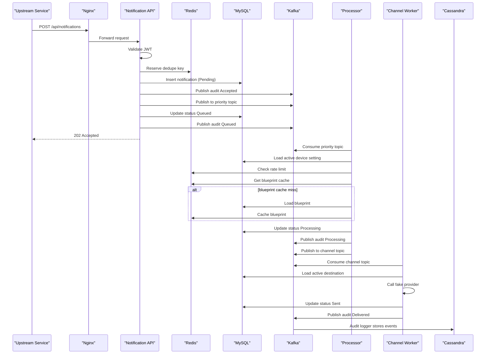
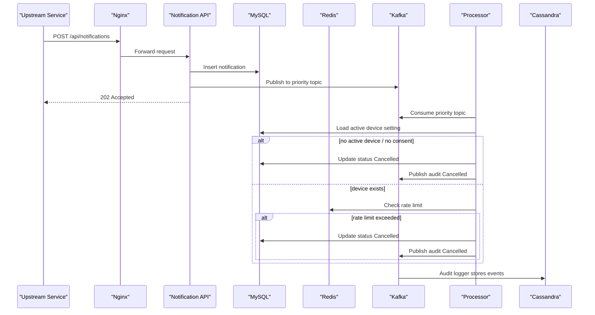
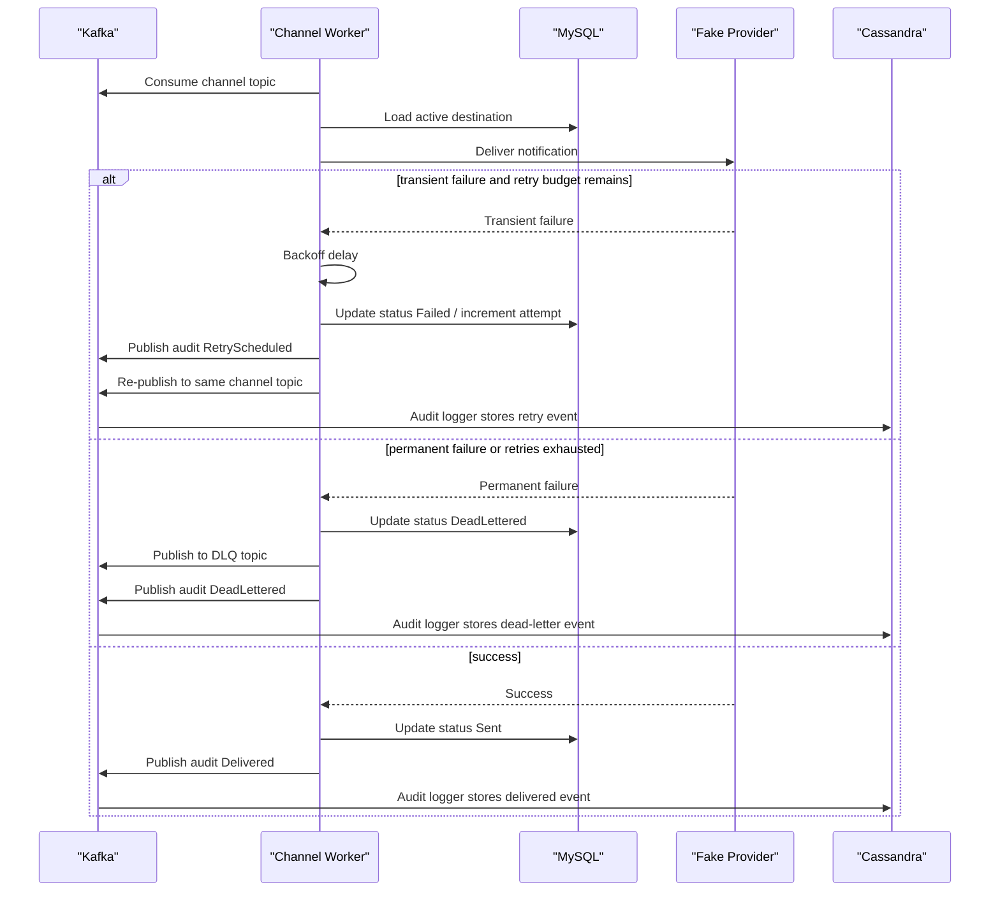

# Sequence Diagrams

Tài liệu này mô tả các flow chính của notification system bằng Mermaid sequence diagram để dễ nhìn hơn khi onboarding hoặc review kiến trúc.

## 1. Success Flow

Đây là luồng chuẩn khi notification đi hết pipeline và được gửi thành công.

## 2. Cancel Flow

Đây là luồng khi notification bị dừng sớm do không có consent hoặc vượt rate limit.

## 3. Retry And DLQ Flow

Đây là luồng khi worker gặp lỗi transient rồi retry, hoặc cuối cùng phải đẩy sang dead-letter queue.

## 4. Cách dùng tài liệu này

Nếu đang onboarding:

- đọc [System-Components-Overview.md](./System-Components-Overview.md) trước
- sau đó xem doc này để chuyển từ “đọc mô tả” sang “nhìn flow”

Nếu đang debug:

- `Success Flow` giúp kiểm tra hệ thống đang kẹt ở API, processor, hay worker
- `Cancel Flow` giúp phân biệt notification bị hủy ở bước consent hay rate limit
- `Retry And DLQ Flow` giúp kiểm tra behavior khi provider lỗi

## 5. Tài liệu liên quan

- [README.md](../README.md)
- [System-Components-Overview.md](./System-Components-Overview.md)
- [Onboarding-Path.md](./Onboarding-Path.md)
